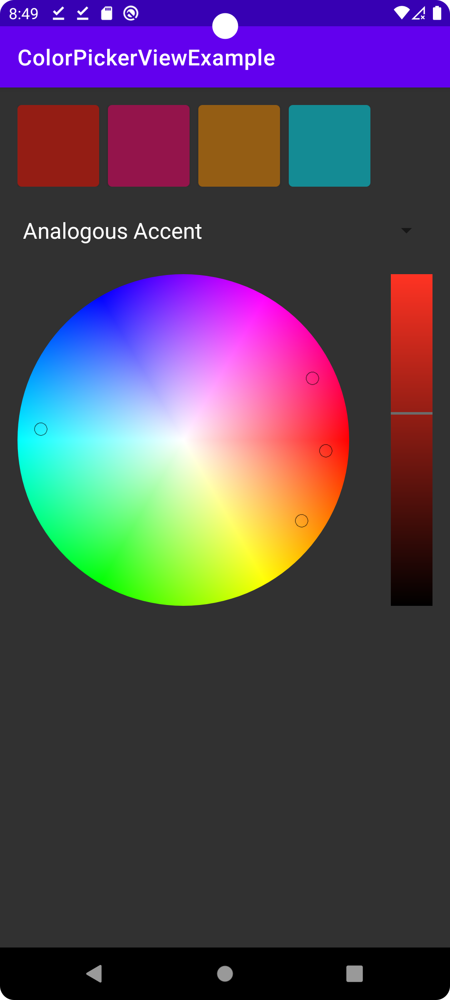

# Color Picker and Harmonizer Library for Android


Color Picker and Harmonizer Library for Android. Pick the color from wheel. Choose harmony type and get list of colors.

# Features:

* Color Picker View
* 11 types of harmony
* Color Selected callback
* Can be untouchable

# Preview


|               Color Picker Mode               |                 Color Harmonizer Mode                 |  
|:---------------------------------------------:|:-----------------------------------------------------:|
|  |  |

# Usage


1. In layout file:

 ```
<ru.kazov.colorpickerview.ColorPickerView
	android:id="@+id/color_picker_view"
	android:layout_width="match_parent"
	android:layout_height="wrap_content" />
 ```

2. In code

```
ColorPickerView colorPickerView = findViewById(R.id.color_picker_view);

//Set color to green
colorPickerView.setColor(Color.GREEN); 

//Set harmony type
colorPickerView.setHarmonyType(ColorPickerView.HarmonyTypes.SPLIT_COMPLEMENTARY); 

//Handle color selection callback
colorPickerView.setColorListener(colorsList -> { }); 

//Set ColorPicker untouchable
colorPickerView.setTouchable(false); 

```

# Compatibility

* Library - Android Lollipop 5.0+ (API 21)
* Sample - Android Lollipop 5.0+ (API 21)

## License

Copyright 2017 Roman Kazov\
Licensed under the Apache License, Version 2.0 (the "License");
you may not use this file except in compliance with the License.
You may obtain a copy of the License at

http://www.apache.org/licenses/LICENSE-2.0

Unless required by applicable law or agreed to in writing, software
distributed under the License is distributed on an "AS IS" BASIS,
WITHOUT WARRANTIES OR CONDITIONS OF ANY KIND, either express or implied.
See the License for the specific language governing permissions and
limitations under the License.